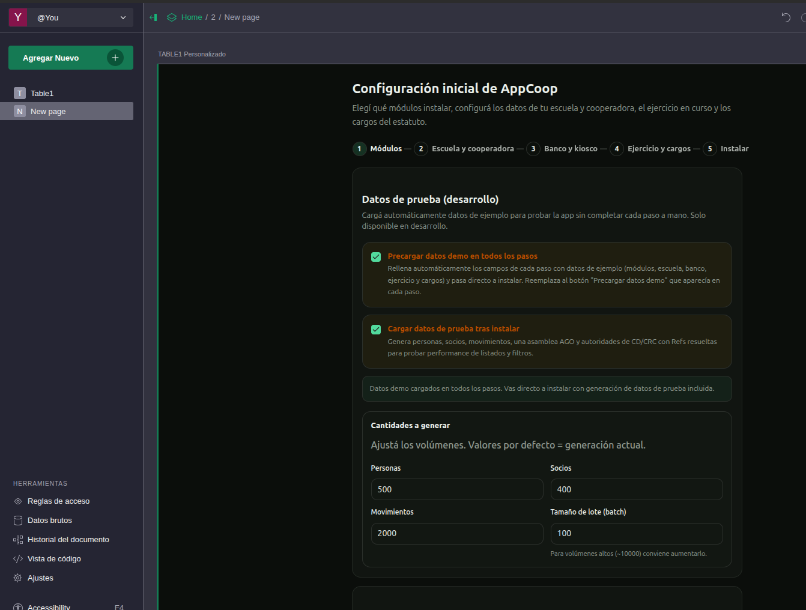

<p align="center">
  
</p>

<h1 align="center">ComunidadCoop</h1>

<p align="center">
  <strong>Tecnología al servicio del pueblo organizado.</strong><br/>
  Gestión integral para cooperadoras escolares de la Provincia de Buenos Aires.
</p>

<p align="center">
  <a href="https://github.com/sosamilton/spa-cooperadora/blob/main/LICENSE"></a>
  <a href="https://github.com/sosamilton/spa-cooperadora/stargazers"></a>
  <a href="https://github.com/sosamilton/spa-cooperadora/issues"></a>
  
  
</p>

<p align="center">
  <a href="https://sosamilton.github.io/spa-cooperadora/">Demo</a> ·
  <a href="https://github.com/sosamilton/spa-cooperadora">Repositorio</a> ·
  <a href="docs/">Documentación</a> ·
  <a href="https://www.getgrist.com/">Grist</a>
</p>

---

ComunidadCoop es una SPA construida con **Svelte 5** que funciona como *Custom Widget* dentro de un documento [Grist](https://www.getgrist.com/). No tiene backend propio: lee y escribe directamente en las tablas del documento. Pensada para funcionar **100% offline**, sin CDNs, APIs externas ni telemetría.

> Construida con software libre bajo AGPL-3.0. Pensada desde el territorio, para compañeras y compañeros sin conocimientos técnicos.

## Características

- **Setup guiado** — wizard paso a paso con formateo en vivo de CUIT/CUE/teléfono/email/CBU, tres modos de gestión (solo PIA/nómina, gestión integral o por etapas), cargos del estatuto al mínimo legal, color de marca como tema de la app, y validación/bloqueo de datos institucionales y bancarios.
- **Socios** — alta, edición y baja con búsqueda instantánea por apellido, DNI, CUIL, email o teléfono. Categoría de vínculo (socio, docente, directivo, proveedor, donante). Validación de mayoría de edad y habilitación electoral automática (activo + 30 días de antigüedad).
- **Personas** — tabla unificada que vincula socios, autoridades, docentes y directivos sin duplicar datos.
- **Movimientos** — entradas, salidas y traspasos con rubro/subrubro según PIA, destino bancario, socio asociado, y combobox con búsqueda para listas grandes. Dashboard con métricas de socios activos, altas/bajas y vencimientos próximos.
- **Gobierno** — comisión directiva y asambleas vinculadas al ejercicio. Inicializar comisión desde los cargos, registrar autoridades con vencimiento de mandato, gestionar ceses y reemplazos, historial completo, crear y editar asambleas con resoluciones. Padrón electoral automático según estatuto modelo.
- **100% offline** — sin dependencias externas. Todos los recursos bundleados localmente.
- **Tema dinámico** — la app toma el color de marca de cada cooperadora como tema primario. Título de pestaña dinámico con el nombre de la institución.

> _Las capturas de pantalla y videos de ejemplo se encuentran en la [landing page](https://sosamilton.github.io/spa-cooperadora/)._

## Inicio rápido

```bash
docker compose up -d --build
```

| Servicio | URL | Rol |
| --- | --- | --- |
| **Grist** | `http://localhost:8484` | Backend — documento SQLite con todas las tablas |
| **LOF** | `http://localhost:8080` | Frontend — la SPA servida por nginx |

**Pasos:** abrir Grist → crear documento → `Add New` → `Add Widget to Page` → `Custom` → pegar URL `http://localhost:8080` → `Full document access` → completar wizard.

> Guía completa de instalación, variables de entorno y troubleshooting en [`docs/DOCKER.md`](docs/DOCKER.md).

## Desarrollo

```bash
npm install
npm run dev          # http://localhost:5173
```

```bash
# Con Docker + hot-reload
docker compose -f docker-compose.dev.yml up
```

> Fuera de Grist la app muestra la landing pública. Para probar con datos reales, cargarla como Custom Widget en un documento Grist. Ver [`docs/DOCKER.md`](docs/DOCKER.md) y [`docs/OFFLINE.md`](docs/OFFLINE.md).

### Seeder de datos de prueba (dev)

En entorno de desarrollo, el primer paso del setup wizard incluye dos checkboxes para agilizar pruebas:

- **Precargar datos demo en todos los pasos** — rellena automáticamente los campos de cada paso (módulos, escuela, banco, ejercicio, cargos) con datos de ejemplo. Reemplaza al botón "Precargar datos demo" que aparece en cada paso cuando no está activo.
- **Cargar datos de prueba tras instalar** — ejecuta un seeder que genera personas, socios, movimientos, una asamblea AGO y autoridades de CD/CRC con todas las Refs resueltas, para probar performance de listados y filtros. Al activarlo se despliega un formulario para customizar las cantidades de cada entidad (personas, socios, movimientos y tamaño de lote), con valores por defecto de 500/400/2000/100.

Si no se seleccionan los checkboxes, cada paso muestra un botón **"Precargar datos demo"** que rellena solo ese paso, permitiendo editar los valores o ajustar configuraciones antes de continuar. El seeder solo está disponible cuando `import.meta.env.DEV` es true y no viaja en el bundle de producción.

<p align="center">
  
</p>

## Documentación

| Documento | Contenido |
| --- | --- |
| [`docs/ARQUITECTURA.md`](docs/ARQUITECTURA.md) | Arquitectura detallada, capas, flujo de datos, integración con Grist |
| [`docs/PATRONES.md`](docs/PATRONES.md) | Patrones de código: runes, stores reactivos, routing, schema |
| [`docs/TECNOLOGIAS.md`](docs/TECNOLOGIAS.md) | Stack tecnológico y justificación de decisiones |
| [`docs/DOCKER.md`](docs/DOCKER.md) | Guía completa de Docker (producción y desarrollo) |
| [`docs/OFFLINE.md`](docs/OFFLINE.md) | Escenarios offline, verificación y migración cloud → local |
| [`docs/modulos/`](docs/modulos/) | Especificación funcional y técnica por módulo |

## Roadmap

| Estado | Item |
| --- | --- |
| Próximo | Adjuntos y actas — carga guiada de comprobantes con trazabilidad |
| Después | Cierres y reportes — cierres mensuales, saldos, exportables PIA/nómina |
| Después | Accesos y roles — permisos por tesorería, comisión, asesoría |
| Futuro | App móvil — consulta de saldos, movimientos, notificaciones |
| Futuro | Integraciones — DIPREGEP y herramientas de gestión escolar |

> El detalle completo de funcionalidades, capturas y lo que viene está en la [landing page](https://sosamilton.github.io/spa-cooperadora/).

## Stack

**Svelte 5** (runes) · **Vite 8** · **Tailwind CSS 4** · **shadcn-svelte** + **bits-ui** · **Grist** (backend) · **Docker** + **nginx** · **Vitest**

## Contribuir

Las contribuciones son bienvenidas. Abrí un [issue](https://github.com/sosamilton/spa-cooperadora/issues) o un PR en el [repositorio](https://github.com/sosamilton/spa-cooperadora).

## Licencia

[AGPL-3.0](LICENSE) — Software libre. La comunidad puede auditar, modificar y distribuir.
