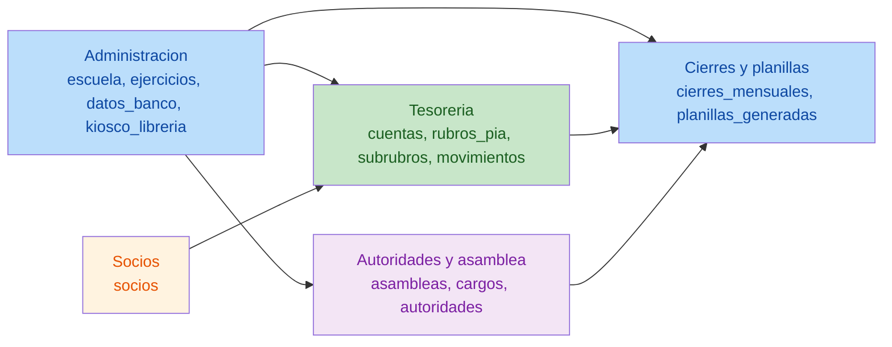
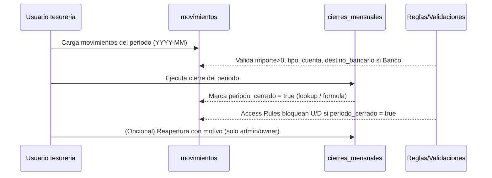

# Analisis de la propuesta (docs_grist_modulos)

## Alcance

Revision integral de los documentos:

- `00_ARQUITECTURA_GENERAL.md`
- `01_MODULO_ADMINISTRACION.md`
- `02_MODULO_COMUNIDAD.md`
- `03_MODULO_GOBIERNO.md`
- `04_MODULO_TESORERIA.md`
- `05_MODULO_CIERRES_Y_REPORTES.md`
- `06_PROMPTS_POR_MODULO.md`

Objetivo del analisis:

1. mejoras funcionales y operativas recomendadas;
2. riesgos tecnicos y fallas operativas potenciales;
3. optimizaciones arquitectonicas y estructurales;
4. plan de accion priorizado por criticidad;
5. pruebas de validacion para no romper flujos existentes.

## Resumen ejecutivo

La propuesta tiene una base solida:

- separa modulo operativo (tesoreria) de configuracion (administracion) y de gobernanza (autoridades y asamblea);
- adopta una convencion doble `nombre fisico / nombre visible`, alineada con Grist (IDs vs labels) y export a SQLite;
- explicita dependencias y deja trazado el riesgo de separar modulos en documentos distintos (Reference no cruza documentos).

El principal riesgo tecnico no resuelto todavia es la estabilidad de claves al exportar:

- en Grist, una columna `Reference` almacena el `rowId` del registro referenciado;
- al exportar a SQLite, el `rowId` puede ser suficiente para un export puntual, pero es fragil para integraciones, merges o sincronizaciones futuras si el documento se recrea.

Por lo tanto, la recomendacion estructural mas importante es introducir claves de negocio/UIDs estables en todas las entidades referenciadas y mantenerlas como parte de la exportacion.

## Diagramas de flujo

### Flujo de dependencias (dominio)

### Flujo operativo clave: cierre mensual

## Coherencia entre documentos (hallazgos)

### Coherencias confirmadas

- Convencion `fisico/visible` consistente en `00` y aplicada en `01..05`.
- Dependencias inter-modulo alineadas con las columnas `_id`:
  - `movimientos.ejercicio_id` / `asambleas.ejercicio_id` / `autoridades.ejercicio_id` -> `ejercicios`
  - `movimientos.socio_id` -> `socios`
  - `movimientos.rubro_id` -> `rubros_pia`
  - `movimientos.cuenta_id` -> `cuentas`
  - `cierres_mensuales.periodo` -> `movimientos.periodo` (por formula/lookup)
- La eleccion de `periodo` como `YYYY-MM` reduce errores operativos y facilita cierres.

### Inconsistencias o deudas documentales

1. `06_PROMPTS_POR_MODULO.md` mantiene titulos historicos como "Modulo Comunidad/Gobierno".
   - No es bloqueante, pero reduce claridad con la nueva nomenclatura.
2. En `04_MODULO_TESORERIA.md` la regla "si cuenta_id = Banco" esta expresada en termino conceptual.
   - En Grist, `Reference` devuelve `rowId`, no el nombre; para reglas/formulas conviene usar una columna derivada, por ejemplo `cuenta_nombre = $cuenta_id.nombre_cuenta`, y comparar `cuenta_nombre == 'Banco'`.
3. Faltan recomendaciones explicitas de indexes y unicidad para export SQLite (por ejemplo, `UNIQUE(periodo, ejercicio_id)` en cierres_mensuales).

## 1) Mejoras funcionales y operativas recomendadas

### 1.1 Bloqueo de periodos cerrados (Access Rules)

Objetivo: evitar cambios post-cierre sin depender solo de disciplina del usuario.

Recomendacion:

- habilitar Access Rules y denegar `U` y `D` en `movimientos` cuando `periodo_cerrado` es true.
- denegar `U` y `D` en `cierres_mensuales` salvo Owners y/o un rol admin definido por tabla de usuarios.

Nota tecnica:

- En Access Rules no se puede navegar referencias con dot-notation; conviene exponer campos derivados como columnas formula en la tabla base y usarlas en reglas.

### 1.2 Trigger formulas para auditoria real

Los campos `creado_por` y `creado_el` como `Text`/`DateTime` son correctos, pero operativamente funcionan mejor con trigger formulas:

- `creado_el`: timestamp automatico al crear (y opcionalmente al editar)
- `creado_por`: autoria basada en usuario

Esto es importante para evitar sesgos (usuarios editando a mano).

### 1.3 Dropdown condicionado: subrubro filtrado por rubro

Recomendacion:

- configurar la columna `movimientos.subrubro_id` con condicion de dropdown para que solo muestre subrubros del `rubro_id` elegido.

Impacto:

- reduce errores de carga;
- reduce necesidad de validaciones a posteriori.

### 1.4 Vistas operativas (usabilidad)

Recomendaciones de vistas por tabla:

- `movimientos`:
  - vista "Carga diaria" (ultimos 30 dias)
  - vista "Por periodo" (filtro por `periodo`)
  - vista "Pendientes de revisar" (`fuera_de_termino` o sin comprobante)
- `cierres_mensuales`:
  - vista "Cierres del ejercicio en curso"
  - vista "Cierres con reapertura"

### 1.5 Summary tables para dashboard

En Grist, para totales por rubro/periodo se recomienda Summary tables (GROUP BY) en lugar de mantener tablas manuales de agregados.

Ejemplos:

- total por `periodo` y `tipo_movimiento`
- total por `rubro_id` en el ejercicio

## 2) Potenciales problemas y riesgos tecnicos

### Critico: claves foraneas basadas solo en rowId

Riesgo:

- `Reference` guarda `rowId` interno.
- si se recrea el documento o se importan datos, los `rowId` pueden cambiar.
- esto rompe integraciones, historico en SQLite y cualquier proceso incremental.

Mitigacion recomendada:

- agregar columnas `uid` o claves de negocio en tablas clave:
  - `socios.socio_uid` (UUID)
  - `movimientos.movimiento_uid` (UUID)
  - `subrubros.subrubro_uid` (UUID)
  - `cuentas.cuenta_codigo` (por ejemplo `BANCO`, `EFECTIVO`, `CAJA_CHICA`)
  - `rubros_pia.codigo_rubro` ya actua como clave estable
  - `ejercicios.ejercicio_uid` o clave compuesta (`anio_inicio`, `mes_inicio`)
- mantener las referencias internas por `Reference` (rowId) para ergonomia en Grist, pero exportar tambien los `uid/codigos` para integracion externa.

### Alto: Choice values como datos persistidos

En Grist, el valor de `Choice` es el dato guardado.
Si se usa `Entrada/Salida/Traspaso` con mayusculas y luego se renombra, se modifican los valores historicos.

Mitigacion:

- usar valores canonicos fisicos (ej. `entrada`, `salida`, `traspaso`) y etiquetas visibles amigables.
- o documentar estrictamente que el set de choices es parte de la API/contrato de exportacion.

### Alto: Adjuntos y export a SQLite

Problema:

- `Attachment` en Grist no se traduce directamente a un tipo SQLite simple.

Mitigacion:

- definir un contrato de export:
  - exportar como JSON/texto con metadatos (nombre, tamaño, URL, id interno), o
  - almacenar los archivos fuera de SQLite y guardar solo referencias.
- documentar el criterio en `00_ARQUITECTURA_GENERAL.md` y en cada tabla con adjuntos.

### Medio: formulas con dependencia cruzada y rendimiento

Riesgo:

- formulas por fila que hagan busquedas pesadas (`lookupRecords`) degradan performance con miles de movimientos.

Mitigacion:

- preferir formulas simples (derivar `periodo` de `fecha`);
- preferir Summary tables para agregados;
- evitar formulas que recorran `movimientos` completo por cada fila.

### Medio: validaciones que Grist no impone de forma nativa

Ejemplos:

- `contrato_hasta >= contrato_desde`
- `fecha_baja >= fecha_alta`

Mitigacion:

- en Grist se pueden expresar con:
  - formulas auxiliares `es_valido` o columnas que marquen error (y filtros por invalido),
  - o Access Rules para impedir actualizaciones inconsistentes (cuando aplique),
  - o guias operativas y vistas.

## 3) Oportunidades de optimizacion arquitectonica y estructural

### 3.1 Capa de integracion: un solo Document como fuente de verdad

Si el objetivo es exportar a SQLite y luego integrar, conviene:

- mantener un Document Grist unificado como fuente de verdad;
- automatizar exports o lecturas por API (`/api/docs/{docId}/sql` para lecturas) en un pipeline externo;
- evitar arquitectura multi-document si hay referencias cruzadas.

### 3.2 Normalizacion minima de "cuentas" y logica bancaria

El modelo actual usa `cuentas` + `destino_bancario`.
Para robustez:

- agregar un codigo fijo a cuentas (`BANCO`, `EFECTIVO`, `CAJA_CHICA`) para evitar depender del texto visible;
- derivar `es_banco` como formula para usar en reglas y formularios.

### 3.3 Indices sugeridos en SQLite (si se materializa)

- `movimientos(periodo)`
- `movimientos(ejercicio_id)`
- `movimientos(rubro_id)`
- `movimientos(socio_id)`
- `movimientos(cuenta_id)`
- `cierres_mensuales(ejercicio_id, periodo)` unique

### 3.4 Tabla de usuarios (cuando sea necesario)

Si varias personas cargan:

- crear `usuarios` como tabla de atributos para Access Rules y autoria.

Si el uso es monousuario:

- mantener `creado_por` como texto en MVP.

## 4) Plan de accion priorizado

### Critico

1. Incorporar `uid/codigos estables` en tablas referenciadas (socios, cuentas, subrubros, ejercicios y movimientos).
2. Definir contrato de export para `Attachment` hacia SQLite (texto/JSON o referencia externa).

### Alto

3. Implementar Access Rules para bloquear `movimientos` en periodos cerrados.
4. Convertir auditoria (`creado_por`, `creado_el`) a trigger formulas o al menos definir el criterio.
5. Normalizar Choice values (canonicos sin acentos) o fijar el set como contrato.

### Medio

6. Agregar dropdown condition para `subrubro_id` filtrado por `rubro_id`.
7. Definir vistas operativas recomendadas (carga diaria, por periodo, pendientes).
8. Agregar indices y uniques sugeridos a la especificacion de export SQLite.

### Bajo

9. Renombrar coherentemente textos en `06_PROMPTS_POR_MODULO.md` para que coincidan con los nuevos nombres de modulo.
10. Agregar un glosario corto de dominio (caja chica, bolsillo, rubro, subrubro).

## 5) Pruebas de validacion (no romper flujos)

### 5.1 Pruebas de esquema (Grist)

- crear tablas con `Table ID` fisico y labels visibles;
- verificar que las referencias se crean correctamente (`Reference` a tablas destino);
- validar que `Choice` contiene el set de valores esperado.

### 5.2 Pruebas de carga operativa

- cargar 20 movimientos de ejemplo (entradas, salidas, traspasos);
- validar:
  - `importe > 0`
  - `periodo` se calcula bien desde `fecha`
  - `destino_bancario` se completa solo cuando aplica
  - `subrubro_id` queda restringido por dropdown al rubro

### 5.3 Pruebas de cierre mensual

- crear `cierres_mensuales` para un periodo con totales y saldos;
- validar que `movimientos.periodo_cerrado` refleje ese cierre;
- intentar editar un movimiento cerrado:
  - esperado: denegado por Access Rules (o marcado como invalido si aun no hay rules).

### 5.4 Pruebas de reapertura

- registrar reapertura con motivo;
- validar que se re-habilite edicion (si ese es el criterio) o que quede trazado el estado.

### 5.5 Pruebas de export a SQLite

- exportar tablas a SQLite/CSV;
- validar:
  - presencia de `uid/codigos` estables;
  - integridad referencial por ids exportados (aunque Grist use rowId internamente);
  - representacion acordada para adjuntos.

### 5.6 Pruebas de performance

- simular 10k movimientos (carga automatizada o import) y validar:
  - que formulas simples siguen fluidas;
  - que los agregados se resuelven via Summary tables.
